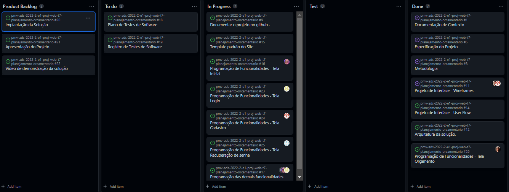

# Metodologia

Pré-requisitos: <a href="2-Especificação do Projeto.md"> Documentação de Especificação</a>

Neste Projeto iremos utilizar a metodologia mostrada no quadro abaixo:

|Ambiente                        | Plataforma            |Link de Acesso                                           |
|--------------------------------|-----------------------|-------------------------------------------------------------------------------------------------------------------------------------------------------------------------------------------------------|
|Documentos do Projeto           |Google Docs              | https://docs.google.com/document/d/1UFvQ2Gaslp388uisy9AIyJHnNrSWEKNk/edit?usp=sharing&ouid=104664687155015801045&rtpof=true&sd=true |
|Repositório de Código Fonte      |Git Hub                |https://github.com/ICEI-PUC-Minas-PMV-ADS/pmv-ads-2022-2-e1-proj-web-t7-planejamento-orcamentario#|
|Projeto de Interface e wireframes |Figma                  |https://www.figma.com/file/p2jHwdLS4o9N20C0ni6ci4/Untitled-(Copy)?node-id=243%3A1     |
|Gerenciamento de Projeto (KANBAN)         |GitHub Projects             |   https://github.com/orgs/ICEI-PUC-Minas-PMV-ADS/projects/166              |
|Estrutura do código | Visual Studio Code| - |

## Gerenciamento de Projeto

### Divisão de Papéis

Será utilizado pela equipe a metodologia ágil SCRUM para todo o desenvolvimento do projeto.

A divisão da equipe será:

- `SCRUM MASTER:`
   - Thiago Gonçalves Chagas;
- `PRODUCT OWNER:`
   - Milleny Ellen Jodas Ferreira;
- `DESENVOLVEDORES:`
   - Daniel Felipe da Fonseca;
   - Guilherme Dcarlo Pires Carneiro;
   - Iane Victoria dos Santos Oliveira;
   - Lucas Bebiano Xavier.

### Ferramentas

As ferramentas empregadas no projeto são:

- `Editor de código:` Visual Studio Code.
- `Ferramentas de comunicação:` WhatsApp, Microsoft Teams e Discord.
- `Ferramenta de desenho de tela:` Figma.
- `Repositório do código fonte:` GitHub.

O VIsual Studio Code foi escolhido porque ele possui uma integração com o
GitHub. Devido a facilitar a comunicação com professor e a familiaridade de acesso pelos alunos as ferramentas de comunicação WhatsApp, Microsoft Teams e Discord foram utilizadas no processo de desenvolvimento deste projeto. Por fim, para criar os wireframes utilizamos a ferramenta Figma por melhor já termos conhecimento da funcionabilidade da mesma, com isto atendendo as necessidades da nossa solução.

### Processo

Para organização de cada etapa das tarefas e o status da mesma utilizamos as descrições abaixo:

- `Backlog do Produto:` 
   - Documentação de Contexto;
   - Especificação do Projeto;
   - Metodologia;
   - Programação de Funcionalidades;
   - Implementação da Solução
   - Registro de Testes;
   - Plano de Testes de Software;
   - Apresentação do Projeto;
   - Vídeo de demostração da solução;

 

- 1. *Sprint 1*
   - 1.1 *Planejamento*
       - 1.1.1 Documentação de contexto: estabelecer o contexto, o problema, os objetivos, a justificativa e o público-alvo do projeto.
       - 1.1.2 Especificação do projeto: estabelecer as personas, histórias de usuários, requisitos funcionais e não funcionais, além das restrições do projeto.
   - 1.2 *Execução*
       - 1.2.1 Responsável(s): toda a equipe contribuiu nessa sprint.
       - 1.2.2 A ferramenta utilizada foi o Google Docs e conseguimos entregar todas as tarefas planejadas.
   - 1.3 *Evidências*
       - 1.3.1 Documentação de contexto: https://github.com/ICEI-PUC-Minas-PMV-ADS/pmv-ads-2022-2-e1-proj-web-t7-planejamento-orcamentario/blob/main/docs/01-Documenta%C3%A7%C3%A3o%20de%20Contexto.md
       - 1.3.2 Especificação do projeto: https://github.com/ICEI-PUC-Minas-PMV-ADS/pmv-ads-2022-2-e1-proj-web-t7-planejamento-orcamentario/blob/main/docs/02-Especifica%C3%A7%C3%A3o%20do%20Projeto.md
       - 1.3.3 O grupo teve dificuldade em associar que as historias de usuario são para destacar somente o que a persona precisaria para poder aplicar a ideia proposta de controle de orçamento.
- 2. *Sprint 2*
   - 1.1 *Planejamento*
       - 2.1.1 Metodologia: definir a composição da equipe de trabalho e as relações de ambiente de trabalho.
       - 2.1.2 Projeto de Interface: definir o fluxo do usuário pelas telas do sistema e o protótipo interativo demonstrando as funcionalidades.
       - 2.1.3 Arquitetura da solução: definir as tecnologias que serão utilizadas no sistema.
   - 2.2 *Execução*
       - 2.2.1 Responsável(s) pela metodologia, arquitetura da solução e documentação: Daniel, Milleny.
       - 2.2.2 Responsável(s) pelo projeto de interface e fluxo dos usuários: Lucas, Iane, Guilherme e Thiago.
       - 2.2.2 As ferramentas utilizadas foi o Google Docs, Figma e o GitHub.
   - 2.3 *Evidências*
       - 2.3.1 Metodologia: https://github.com/ICEI-PUC-Minas-PMV-ADS/pmv-ads-2022-2-e1-proj-web-t7-planejamento-orcamentario/blob/main/docs/03-Metodologia.md
       - 2.3.2 Projeto de Interface: https://github.com/ICEI-PUC-Minas-PMV-ADS/pmv-ads-2022-2-e1-proj-web-t7-planejamento-orcamentario/blob/main/docs/04-Projeto%20de%20Interface.md
       - 2.3.3 Arquitetura da solução: https://github.com/ICEI-PUC-Minas-PMV-ADS/pmv-ads-2022-2-e1-proj-web-t7-planejamento-orcamentario/blob/main/docs/05-Arquitetura%20da%20Solu%C3%A7%C3%A3o.md
       - 2.3.4 No momento de criar o Kanban o Daniel, Thiago e Milleny tiveram uma pequena duvida em relação a qual processo teria que ter os itens mais genericamente e qual era para derivar deste primeiro processo, ápos conversamos e pesquisar no material do canvas e na web chegamos a conclusão que o Backlog do produto precisa ter os itens principais e as sprints do produto são processos entregaveis que derivam de cada item do backlog do produto.
- 2. *Sprint 3*
   - 1.1 *Planejamento*
       - 2.1.1 Template padrão do Site.
       - 2.1.2 Programação de funcionalidades.
   - 2.2 *Execução*
       - 2.2.1 Responsável(s) pela página inicial: Iane.
       - 2.2.2 Responsável(s) pela página de login: Daniel.
       - 2.2.3 Responsável(s) pela página de cadastro: Lucas.
       - 2.2.4 Responsável(s) pela página de recuperação de senha: Thiago.
       - 2.2.5 Responsável(s) pelas demais telas: Milleny.
       - 2.2.2 As ferramentas utilizadas foi o Google Docs, Figma, GitHub e Visual Studio Code.
   - 2.3 *Evidências*
       - 2.3.1 Template padrão do Site: https://github.com/ICEI-PUC-Minas-PMV-ADS/pmv-ads-2022-2-e1-proj-web-t7-planejamento-orcamentario/blob/main/docs/06-Template%20padr%C3%A3o%20do%20Site.md
       - 2.3.2 Programação de funcionalidades: 
       
       - 2.3.3 
- 2. *Sprint 4*
   - 1.1 *Planejamento*
       - 2.1.1 Programação das demais funcionalidades.
       - 2.1.2 Plano de Testes de Software.
       - 2.1.3 Registro de Testes de Software.
   - 2.2 *Execução*
       - 2.2.1 Responsável(s) pela página inicial: Iane.
       - 2.2.2 Responsável(s) pela página de login: Daniel.
       - 2.2.3 Responsável(s) pela página de cadastro: Lucas.
       - 2.2.4 Responsável(s) pela página de recuperação de senha: Thiago.
       - 2.2.5 Responsável(s) pelas demais telas: Milleny.
       - 2.2.2 As ferramentas utilizadas foi o Google Docs, Figma, GitHub e Visual Studio Code.
   - 2.3 *Evidências*
       - 2.3.1 Programação das demais funcionalidades: https://github.com/ICEI-PUC-Minas-PMV-ADS/pmv-ads-2022-2-e1-proj-web-t7-planejamento-orcamentario/tree/main/src
       - 2.3.2 Plano de Testes de Software: https://github.com/ICEI-PUC-Minas-PMV-ADS/pmv-ads-2022-2-e1-proj-web-t7-planejamento-orcamentario/blob/main/docs/08-Plano%20de%20Testes%20de%20Software.md
       - 2.3.3 Registro de Testes de Software: https://github.com/ICEI-PUC-Minas-PMV-ADS/pmv-ads-2022-2-e1-proj-web-t7-planejamento-orcamentario/blob/main/docs/09-Registro%20de%20Testes%20de%20Software.md
       - 2.3.4 