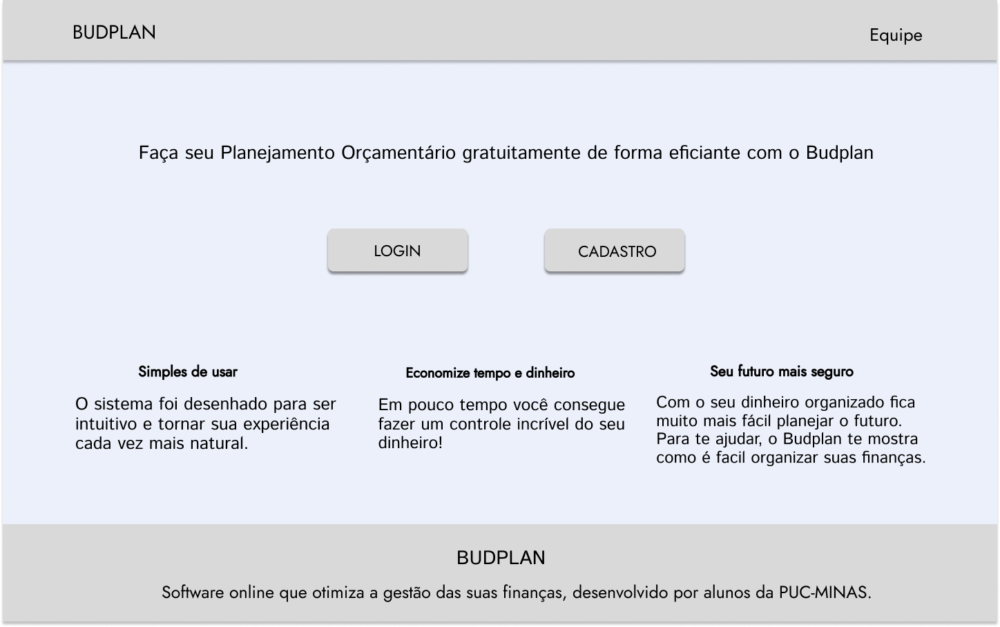
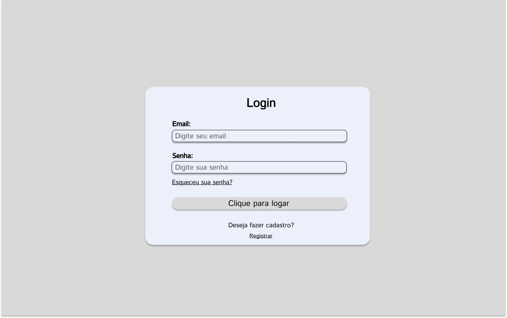
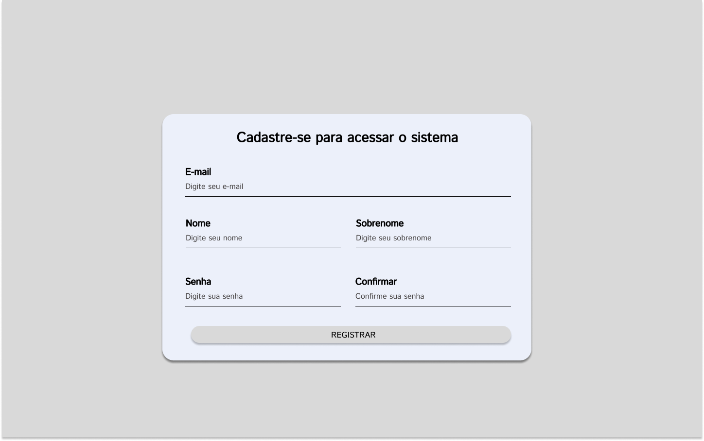
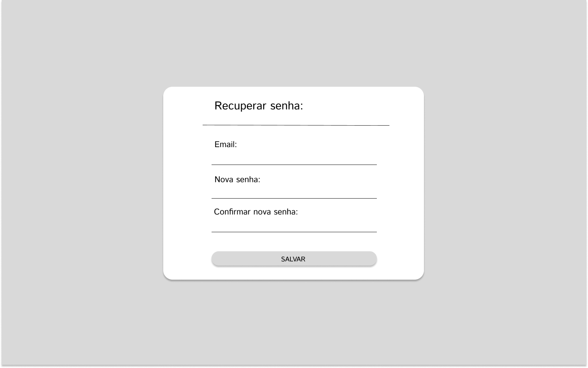
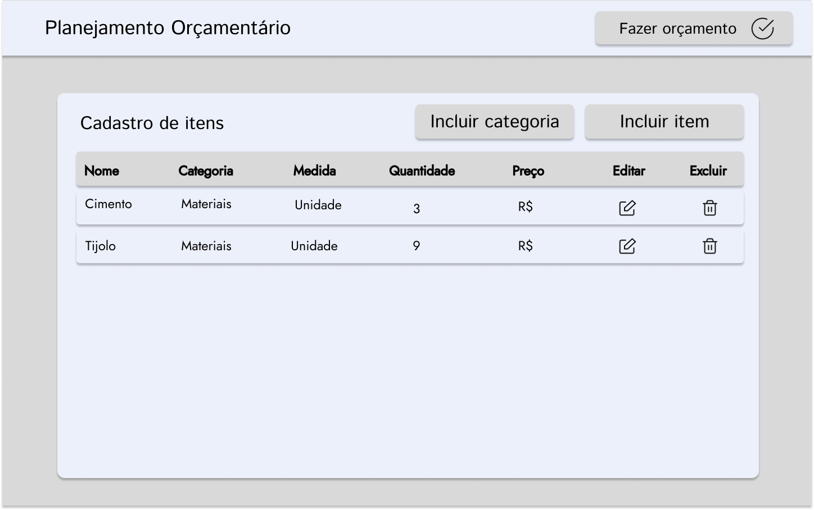
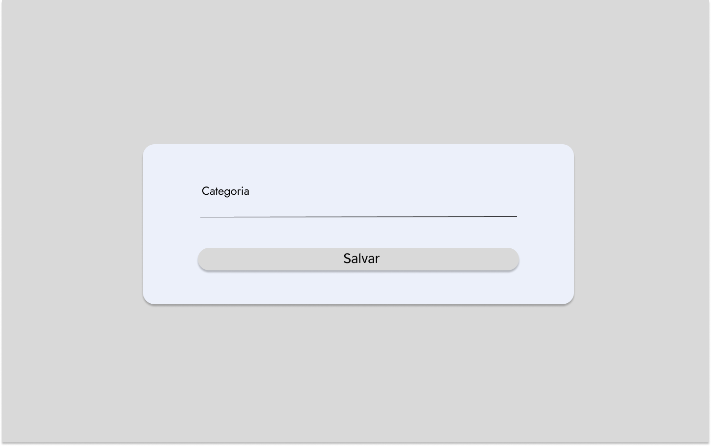
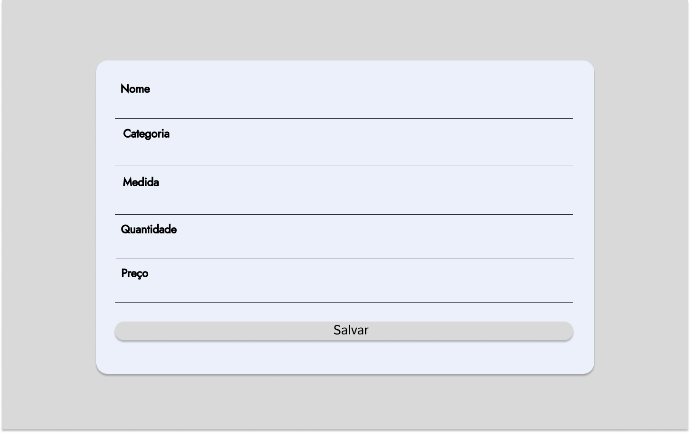
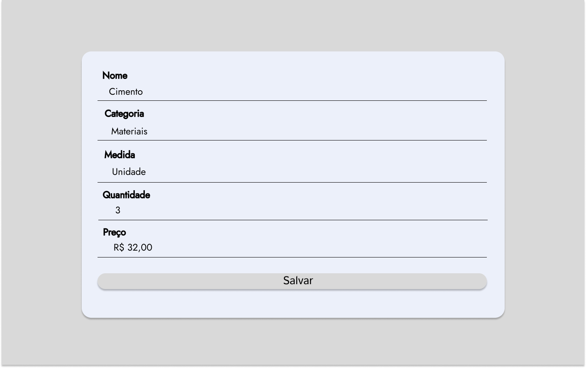
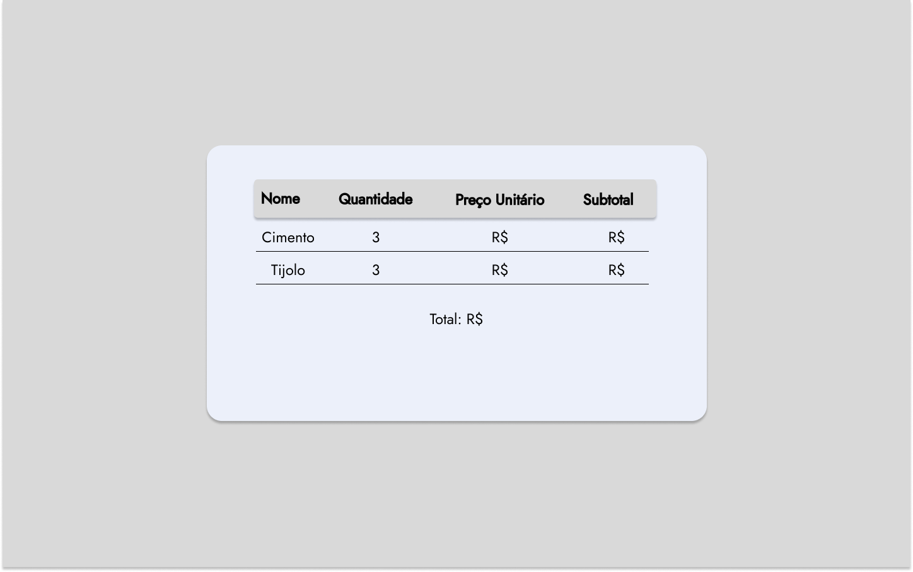

# Projeto de Interface

Pré-requisitos: <a href="2-Especificação do Projeto.md"> Documentação de Especificação</a>

Visão geral da interação do usuário pelas telas do sistema e protótipo interativo das telas com as funcionalidades que fazem parte do sistema (wireframes).

## User Flow

O diagrama apresentado abaixo mostra o fluxo de interação do usuário pelas telas do sistema. Cada uma das telas deste fluxo é detalhada na seção de Wireframes que se segue.

 

## Wireframes

**TELA - INICIAL**
- Essa tela será a primeira apresentada ao usuário. Contém botões para que o usuário consiga efetuar o login e/ou cadastro, além disso o ele pode saber mais sobre o projeto e conhecer toda a equipe.
  

**TELA - EFETUAR LOGIN**
- A tela Efetuar Login será utilizada apenas quando o usuário já estiver cadastrado, tendo o campo e-mail e senha para conseguir acessar suas informações individuais.
 
 

 
 
 **TELA - NOVO CADASTRO**
 - Na tela Novo Cadastro, caso o usuário não tenha cadastro ele terá que cadastrar para criar um login. Para se cadastrar basta clicar em registre-se e o mesmo será redirecionado para uma tela de novo cadastro, onde o usuário irá preencher as informações requeridas e com isto o novo cadastro será criado.
 
 
 
 
 **TELA - RECUPERAR SENHA**
- O usuário só será encaminhado para tela Recuperar Senha caso não lembre suas senha cadastrada na tela Novo Cadastro, para recuperar a senha basta clicar no link CLIQUE AQUI na tela Efetuar Login que o mesmo será direcionado para tela Recuperar senha será necessário digitar o email, e a senha duas vezes.
 

**TELA - TELA DE ITENS E ORÇAMENTO**
- Nessa tela, o usuário consegue ver todos os produtos cadastrados em uma tabela com os seguintes campos: nome, categoria, medida, quantidade, preço. Ele também consegue cadastrar uma nova categoria, incluir novos itens e fazer um orçamento dos produtos cadastrados.

**TELA - CADASTRAR CATEGORIA**
- Nesse modal conseguimos cadastrar categorias que possam nos auxiliar a distinguir os itens.
  

**TELA - ADICIONAR ITEM**
- No modal de adicionar item, o usuário conseguirá adicionar um novo produto preenchendo os campos: nome, categoria, medida, quantidade e o preço unitário do produto. E depois de preenchido basta clicar em salvar para adicionar o produto a tabela de produtos.

**TELA - EDITAR ITEM**
- O modal de editar item contém todos os campos da incluir item, porém quando ativada ele vem com os campos preenchidos com seus respectivos valores. 

**TELA - FAZER ORÇAMENTO**
- Um modal será apresentado mostrando uma tabela com os itens cadastrados, com os seguintes campos: nome, quantidade, preço unitário e o subtotal daquele produto. Abaixo da tabela será fornecido um total de todos os produtos.

