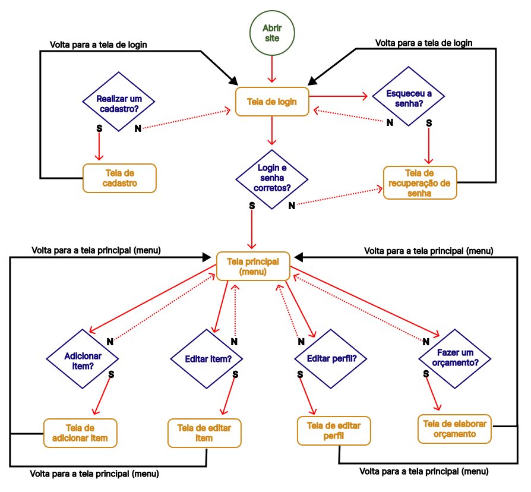

# Projeto de Interface

Pré-requisitos: <a href="2-Especificação do Projeto.md"> Documentação de Especificação</a>

Visão geral da interação do usuário pelas telas do sistema e protótipo interativo das telas com as funcionalidades que fazem parte do sistema (wireframes).

## User Flow

O diagrama apresentado abaixo mostra o fluxo de interação do usuário pelas telas do sistema. Cada uma das telas deste fluxo é detalhada na seção de Wireframes que se segue.

 

## Wireframes

**TELA - EFETUAR LOGIN**
- A tela efetuar login contem textbox onde recebera informações digitadas pelo usuario para poder ter acesso ao seu cadastro e suas informações.

 
 
 **TELA - NOVO CADASTRO**
 - Caso usuário não tenha cadastro ele irá clicar em registre-se e o mesmo será redirecionado para uma tela de novo cadastro, onde o usuario irá preencher as informações requeridas e com isto o novo cadastro será criado.
 
 
 
 
 **TELA - RECUPERAR SENHA**
- Na tela de login caso o usuario esquecer sua senha o mesmo poderá clicar no link CLIQUE AQUI que o mesmo será direcionado para tela que criara uma nova senha.
 

**TELA - EDITAR PRODUTO**
- Nesta tela o usuario poderá navegar nas telas adicionar produto

**TELA - ADICIONAR PRODUTO**
- A tela

**TELA - CRIAR ORÇAMENTO**
> - A tela

