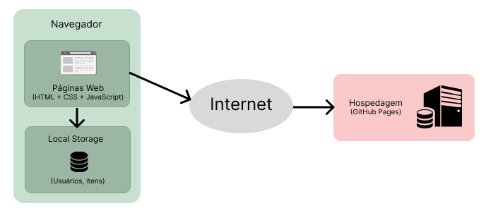

# Arquitetura da Solução

Pré-requisitos: <a href="3-Projeto de Interface.md"> Projeto de Interface</a>

Definição de como o software é estruturado em termos dos componentes que fazem parte da solução e do ambiente de hospedagem da aplicação.

## Diagrama de componentes

Nesta seção são apresentados os detalhes técnicos da solução criada pela equipe, tratando dos componentes que fazem parte da solução e do ambiente de hospedagem da solução.

Figura 1 - Arquitetura da Solução

A solução implementada conta com os seguintes módulos:
- **Navegador** - Interface básica do sistema  
  - **Páginas Web** - Conjunto de arquivos HTML, CSS, JavaScript e imagens que implementam as funcionalidades do sistema.
   - **Local Storage** - armazenamento mantido no Navegador, onde são implementados bancos de dados baseados em JSON. São eles: 
     - **Usuários** - usuários cadastrados no sistema
     - **Itens** - registro de itens cadastrados
 - **Hospedagem** - local na Internet onde as páginas são mantidas e acessadas pelo navegador. 

Inclua um diagrama da solução e descreva os módulos e as tecnologias que fazem parte da solução. Discorra sobre o diagrama.

## Tecnologias Utilizadas
Será utilizado as três principais linguagens de desenvolvimento web fron-end e as demais ferramentas necessárias para a implementação do sistema:
  - `HTML`
  - `CSS`
  - `JavaScript`
  - `Git`
  - `GitHub`
  - `Visual Studio Code`

## Hospedagem

O site utiliza a plataforma do GitHub como ambiente de hospedagem do site do projeto. O site é mantido no ambiente da URL: [Budplan](https://icei-puc-minas-pmv-ads.github.io/pmv-ads-2022-2-e1-proj-web-t7-planejamento-orcamentario/)

A publicação do site no GitHub Pages é feita por meio de uma submissão do projeto (push) via git para o repositório remoto que se encontra no GitHub.
