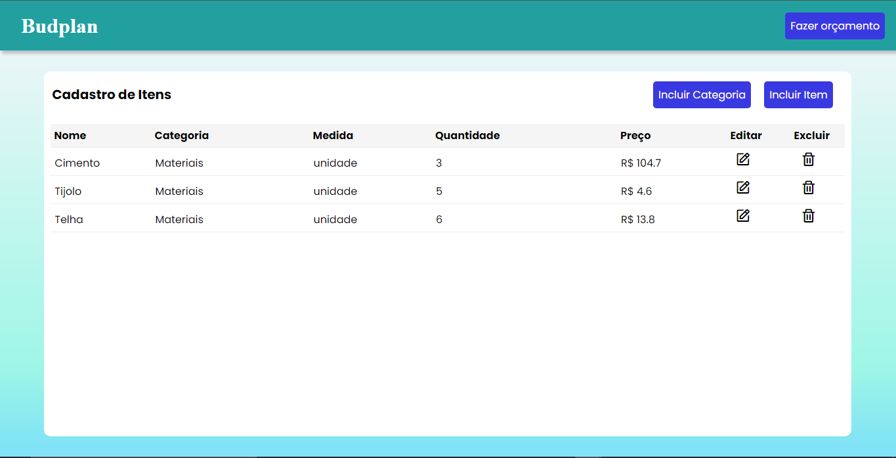
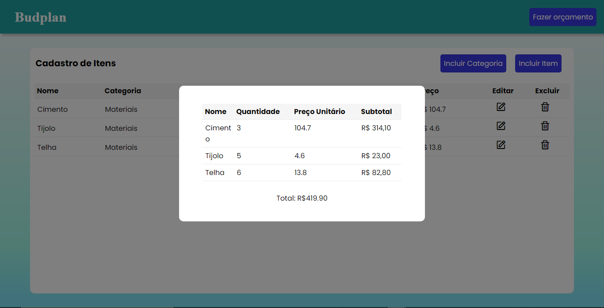

# Template padrão do site

Pré-requisitos: <a href="2-Especificação do Projeto.md"> Especificação do Projeto</a>, <a href="3-Projeto de Interface.md"> Projeto de Interface</a>, <a href="4-Metodologia.md"> Metodologia</a>

Layout padrão do site (HTML e CSS) que será utilizado em todas as páginas com a definição de identidade visual, aspectos de responsividade e iconografia.

Figura 1: Página Inicial - Parte 1

Figura 2: Página Inicial - Parte 1

Figura 3: Página de Login

Figura 4: Página de Cadastro

Figura 5: Página de Recuperação de Senha

Figura 6: Página de Adicionar e Editar Item

Figura 7: Página de Adicionar Categoria

Figura 8: Página de Adicionar um Item

Figura 9: Página de Fazer um Orçamento
