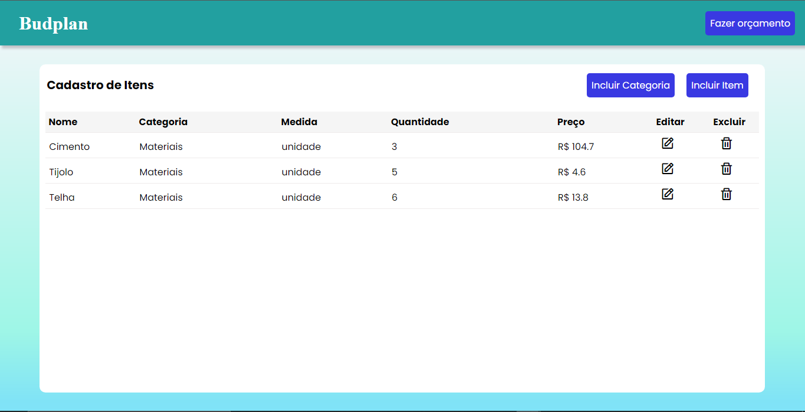
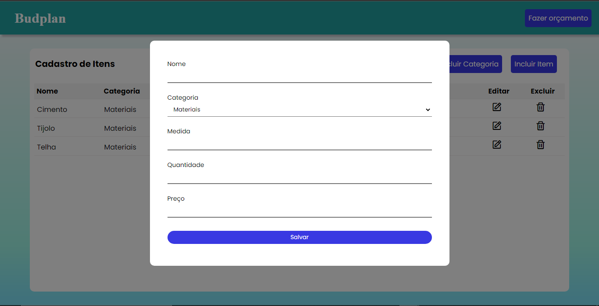
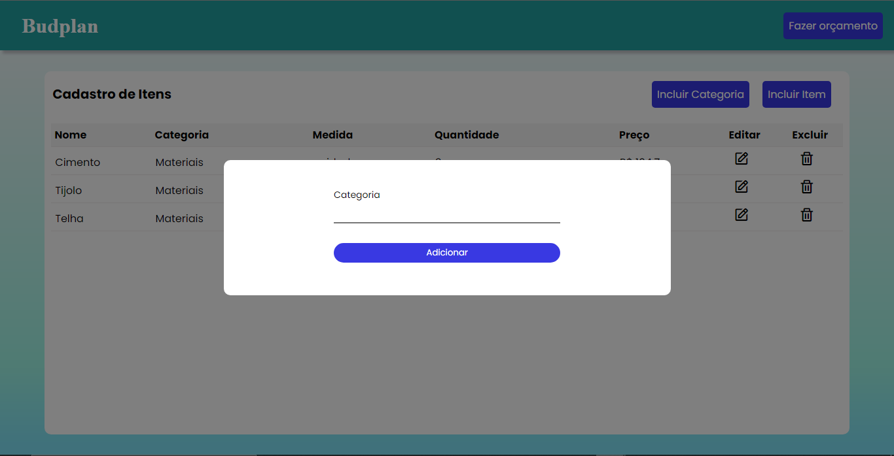
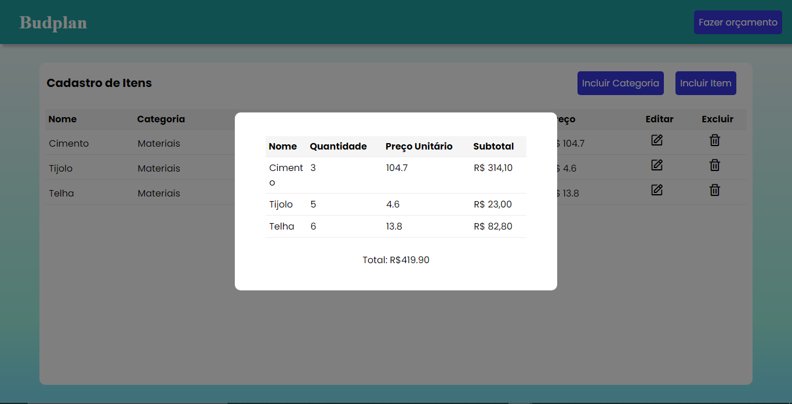

# Programação de Funcionalidades

Pré-requisitos: <a href="2-Especificação do Projeto.md"> Especificação do Projeto</a>, <a href="3-Projeto de Interface.md"> Projeto de Interface</a>, <a href="4-Metodologia.md"> Metodologia</a>, <a href="3-Projeto de Interface.md"> Projeto de Interface</a>, <a href="5-Arquitetura da Solução.md"> Arquitetura da Solução</a>

Nesta seção são apresentadas as telas desenvolvidas para cada uma das funcionalidades do sistema. O respectivo endereço (URL) e outras orientações de acesso são apresentadas na sequência.

## Adicionar e editar itens (RF-01)
A tela principal do sistema apresenta itens que foram cadastrados, os ítens são armazenados no LocalStorage com estruturas de dados baseada em JSON. Além disso, a tela também fornece a possibilidade de incluir categorias para organizar os itens. Um exemplo da tela é apresentado abaixo.

### Requisitos atendidos
    - RF-01 - O site deve permitir ao usuário inserir e editar itens cadastrados organizados por categorias.

### Artefatos da funcionalidade
    - orcamento.html
    - script.js
    - orcamento.css

### Estrutura de dados
~~~Itens
{
	"itens": [
		{
			"id": 1,
			"nome": "Cimento",
			"categoria": "0",
			"medida": "unidade",
			"quantidade": “3”,
			"preco": "104,7"
		}
	]
}
~~~
~~~Categorias
{
	"categorias": [
		“Materiais”,
		“Casa”
	]
}
~~~

### Instruções de acesso
    1. Abra um navegador de Internet e informe a seguinte URL: [ainda não implementado]
    2. A tela de adicionar e editar itens é a primeira apresentada ao usuário logado.
    3. Para inserir uma categoria, basta clicar no botão “Incluir Categoria”, digitar a categoria a ser cadastrada e clicar em “Adicionar”.
    4. Para inserir um item, basta clicar no botão “Incluir Item”, preencher todos os campos e clicar em “Salvar”.

   
## Modal de fazer orçamento (RF-02)
O modal de fazer orçamento retorna alguns dados dos itens e também o subtotal daquele item. Também será fornecido o total de todos os itens.

### Requisitos atendidos
    - RF-02 - O site deve permitir ao usuário fazer análises dos orçamentos através do subtotal do produto e total de todos os produtos

### Artefatos da funcionalidade
    - orcamento.html
    - script.js
    - orcamento.css

### Instruções de acesso
    1. Na página principal do orçamento, clique em “Fazer Orçamento”;

  
## Modal de editar item (RF-03)
O modal de editar itens permite que os usuários mantenham os itens cadastrados atualizados, podendo alterar qualquer um dos campos.

### Requisitos atendidos
    - RF-03 - O site deve permitir ao usuário manter os dados dos itens cadastrados atualizados.

### Artefatos da funcionalidade
    - orcamento.html
    - script.js
    - orcamento.css

### Instruções de acesso
    1. Na página principal do orçamento, clique no ícone da coluna editar, os campos devem vir preenchidos para facilitar alterações;
