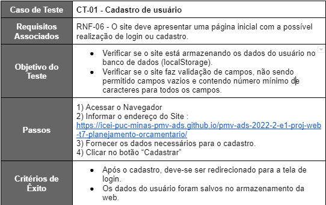
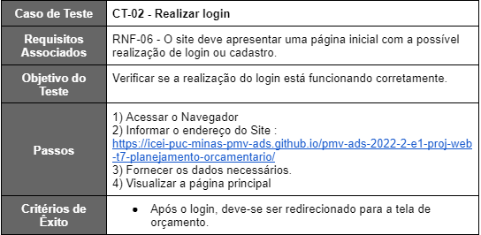
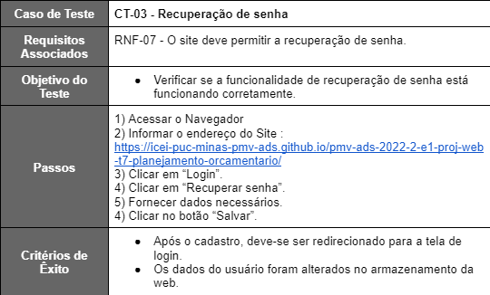
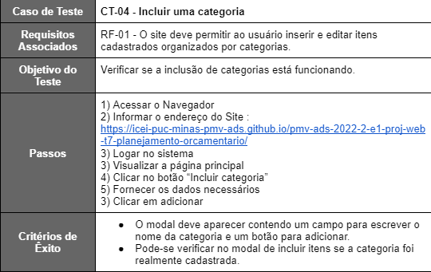
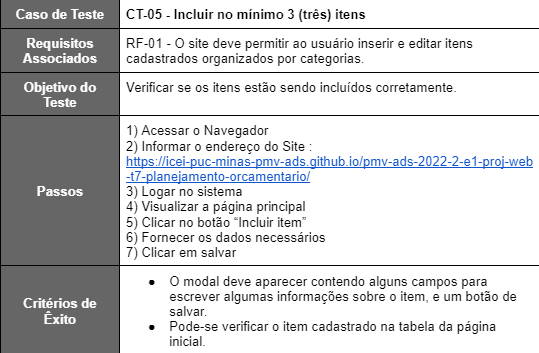
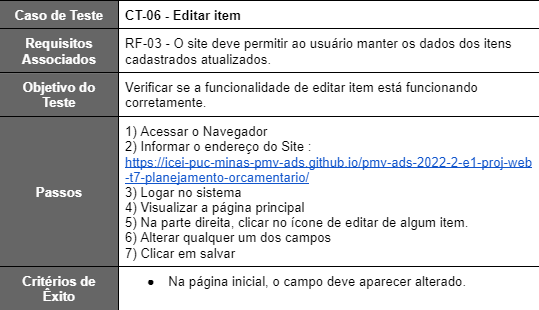
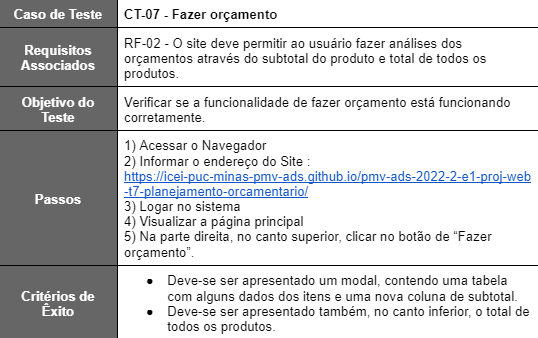

# Plano de Testes de Software

Pré-requisitos: <a href="2-Especificação do Projeto.md"> Especificação do Projeto</a>, <a href="3-Projeto de Interface.md"> Projeto de Interface</a>

Os requisitos para realização dos testes de software são:
- 
- Site publicado na Internet
- Navegador da Internet - Chrome, Firefox ou Edge
- Conectividade de Internet para acesso às plataformas (APIs)

Os testes funcionais a serem realizados no aplicativo são descritos a seguir.
- 

 

 

 

 

 

 

 