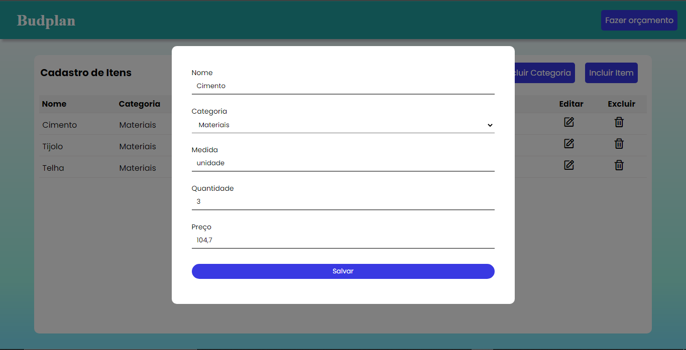
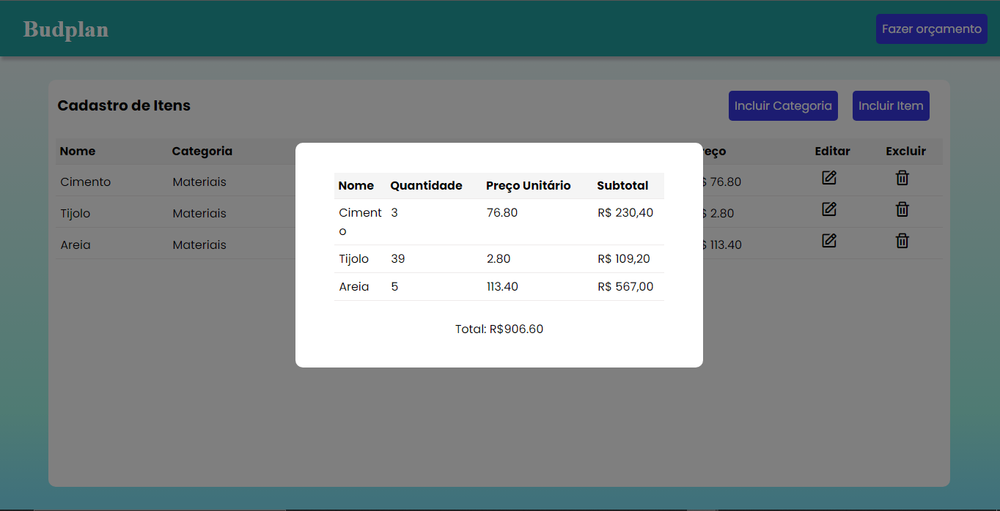

# Registro de Testes de Software

Pré-requisitos: <a href="3-Projeto de Interface.md"> Projeto de Interface</a>, <a href="8-Plano de Testes de Software.md"> Plano de Testes de Software</a>

Relatório com as evidências dos testes de software realizados no sistema pela equipe, baseado em um plano de testes pré-definido.

## Avaliação

Os resultados obtidos nos testes de software realizados são descritos abaixo. 

### CT-01 - Cadastro de usuário

Na página inicial, cliquei no botão “CADASTRO” e assim fui redirecionado para a página mostrada acima.  
Preenchi o campo de nome com o valor “Milleny”, o de usuário com “milleny”, de e-mail com “ellenmilleny@gmail.com” e o de senha e confirmar senha com “adasadas2”.  
Logo após preencher os campos, cliquei no botão “Cadastrar” e fui redirecionado para a página de login.  
Podemos verificar o sucesso do teste acessando o armazenamento local, em listaUser, mostrado na figura abaixo.

### CT-02 - Realizar login

Acessei a página inicial , cliquei no botão “Login” e fui redirecionado para a página de fazer login mostrada acima.  
No campo usuário coloquei “milleny” e no campo senha coloquei “adasadas2”. Depois de colocar meu nome de usuário e senha, cliquei no botão “Entrar”.  
Podemos verificar o sucesso do teste acessando o armazenamento local, em userLogado, mostrado na figura abaixo.

### CT-03 - Recuperação de senha

Acessei a página inicial , cliquei no botão “Login” e fui redirecionado para a página de fazer login mostrada acima. Cliquei em “Recuperar senha” e fui para a página de recuperar a senha.  
Preenchi o campo de e-mail com “milleny@gmail.com” e os campos nova senha e confirmar senha com “asdasd2” e cliquei no botão “Salvar”.  
Podemos verificar que o teste não foi bem sucedido pela imagem abaixo.

### CT-04 - Incluir uma categoria

Após realizar o login, detalhado em um teste acima, fui redirecionado para a tela principal. Nela estão presentes 3 (três) botões: incluir categoria, incluir item e fazer orçamento.  
Cliquei no botão "incluir categoria", tendo uma visão igual à imagem acima, podemos digitar qualquer categoria que precisaremos utilizar mais a frente. Nesse teste digitei “Materiais” e logo em seguida cliquei no botão “Adicionar”.   
Podemos verificar o sucesso do teste acessando o armazenamento local, mostrado na figura abaixo. 

### CT-05 - Incluir no mínimo 3 (três) itens

Após realizar o login, detalhado em um teste acima, fui redirecionado para a tela principal. Cliquei no botão “Incluir item”, que abre um modal como o apresentado na figura acima.  
Para o primeiro item, preenchi o campo de nome com “cimento”, a categoria ficou como “Materiais”, a medida com o valor “unidade”, a quantidade foi “3” e o preço foi de “76,80”.  
O segundo item, preenchi o campo de nome com “Tijolo”, a categoria ficou como “Materiais”, a medida com o valor “unidade”, a quantidade foi “50” e o preço foi de “2,80”.  
O último item, preenchi o campo de nome com “Areia”, a categoria ficou como “Materiais”, a medida com o valor “metro”, a quantidade foi “5” e o preço foi de 113,40”.  
Podemos verificar o sucesso do teste observando que os itens incluídos estão sendo apresentados na página principal, como na figura abaixo.

### CT-06 - Editar item

Após realizar o login, detalhado em um teste acima, fui redirecionado para a tela principal. Cliquei no botão “Incluir item”, que abre um modal como o apresentado na figura acima.  
Alterei o campo quantidade do segundo item que havia cadastrado no teste anterior, o Tijolo. A quantidade alterada foi de 50 para 39.  
Podemos verificar o sucesso do teste observando que o item apresenta na página principal agora a quantidade como 39, como na figura abaixo.

### CT-07 - Fazer orçamento
Após realizar o login, detalhado em um teste acima, fui redirecionado para a tela principal. Com alguns itens já cadastrados, cliquei no botão “Fazer orçamento”.  
Nele, foi me apresentado o nome, a quantidade, o preço unitário, o valor total do produto e o valor total de todos os produtos.  
Podemos verificar o sucesso do teste observando o modal apresentado na figura abaixo.
